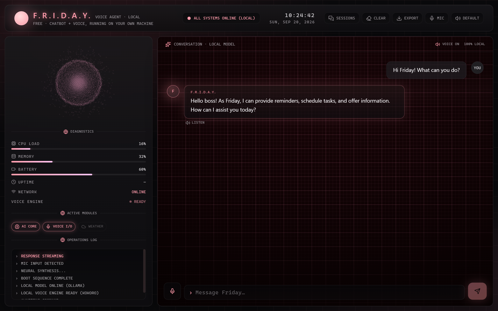
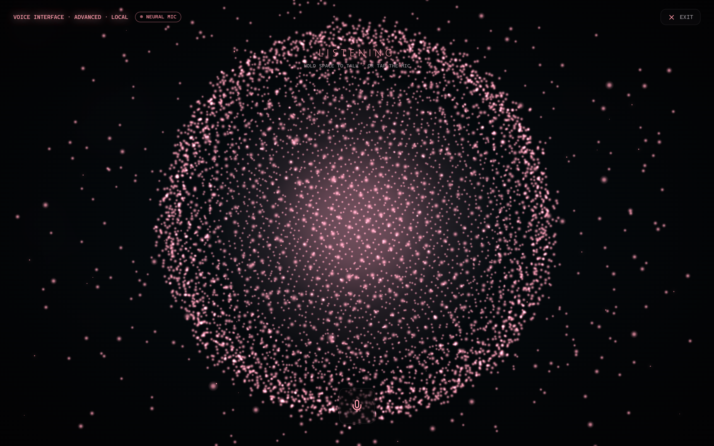

# FRIDAY Demo — um chatbot e agente de voz gratuito, tudo local

🌐 [English](../README.md) · [Italiano](README.it.md) · [Español](README.es.md) · [Français](README.fr.md) · [Deutsch](README.de.md) · **Português** · [हिन्दी](README.hi.md)

[](https://github.com/Alex-Stark-industries/FRIDAY-Demo/releases/latest)
[](../LICENSE)
[](https://github.com/Alex-Stark-industries/FRIDAY-Demo/releases/latest)

**Um chatbot e assistente de voz com IA, gratuito, que roda inteiramente no seu
próprio computador.** Escreva ou fale — a Friday responde por texto e também em
voz alta, com uma voz que você escolhe — **sem conta, sem chave de API, sem
assinatura, sem nuvem e sem telemetria.** Nada do que você diz é enviado a
nenhum servidor: o modelo roda localmente via [Ollama](https://ollama.com), e a
voz funciona no dispositivo.

> **Local. Privado. Grátis.** Baixe o instalador, execute-o e comece a falar. A
> Friday responde em **inglês**.

Isto é uma amostra gratuita do assistente de desktop **Friday**, mais completo.
Ela mantém apenas duas coisas — o **chat** e o **modo de voz avançado** — e nada
mais.

---

### Em resumo

- 💬 **Chat** — um modelo de linguagem local via [Ollama](https://ollama.com), com a resposta aparecendo palavra por palavra.
- 🎙️ **Modo de voz avançado** — uma esfera de partículas em tela cheia, mãos livres, com detecção neural do momento de fala. Segure **Espaço** ou toque no microfone; ela ouve, pensa e responde em voz alta.
- 🔊 **Seis vozes no dispositivo** — escolha a que preferir no cabeçalho. O áudio nunca sai da sua máquina.
- 💾 **Sessões salvas** — suas conversas anteriores ficam salvas localmente e podem ser recarregadas.
- 🌐 **Voz totalmente offline** — o motor de voz (Kokoro) e o runtime já vêm incluídos; só o download único dos modelos de voz e suas mensagens para o seu próprio Ollama passam pela rede.
- 🇬🇧 **Sempre em inglês** — não importa o que você escreva ou fale, a Friday responde em inglês.

---

### Capturas de tela

<table>
<tr>
<td width="50%">

**Chat** — o núcleo neural, diagnósticos ao vivo e uma conversa em streaming com o modelo local.


</td>
<td width="50%">

**Modo de voz avançado** — uma esfera reativa em tela cheia com detecção neural do microfone; segure Espaço ou toque para falar.


</td>
</tr>
</table>

---

### Download e instalação

1. Abra a página de [**Releases**](https://github.com/Alex-Stark-industries/FRIDAY-Demo/releases/latest) e baixe
   `Friday-Voice-Agent-Setup-<versão>.exe`.
2. Execute-o. O instalador é **por usuário** — **não precisa de direitos de
   administrador**.
3. Inicie o **Friday Voice Agent** pelo menu Iniciar (ou pelo atalho na área de
   trabalho, se você pediu um).

> **Primeira execução:** o instalador não é assinado digitalmente, então o Windows
> SmartScreen pode mostrar *"O Windows protegeu seu computador"*. Clique em **Mais
> informações → Executar assim mesmo**. Isso é normal em apps gratuitos e
> independentes.

Primeira vez aqui? O [**guia de boas-vindas e instalação**](WELCOME.pt.md)
acompanha você passo a passo, sem pressupor nada.

### Configuração inicial (obrigatória)

O "cérebro" da Friday roda localmente via **Ollama**, um motor de IA local e
gratuito:

1. Instale o [Ollama](https://ollama.com).
2. Baixe o modelo uma vez, em um terminal:
   ```
   ollama pull qwen2.5:3b
   ```
3. Verifique se o Ollama está em execução e então inicie a Friday.

Na primeira vez que você abre a voz, os modelos de voz são baixados uma única vez
(algumas centenas de MB); depois disso, tudo funciona para sempre offline.

---

### Documentação

| Documento | Sobre o que é |
|---|---|
| [Boas-vindas e instalação](WELCOME.pt.md) | Para iniciantes, passo a passo: instalar, iniciar, primeiro chat, primeira voz |
| [Changelog](../CHANGELOG.md) | O que mudou em cada versão (em inglês) |
| [Licença](../LICENSE) | MIT — uso livre |

---

### Requisitos do sistema

A Friday executa o modelo de IA e a voz **na sua própria máquina**, então o
resultado depende do seu PC. Estes são os mínimos realistas para o modelo incluído
`qwen2.5:3b`.

| | Mínimo | Recomendado |
|---|---|---|
| **Sistema operacional** | Windows 10 / 11, 64 bits | Windows 11, 64 bits |
| **CPU** | Qualquer processador moderno de 64 bits (x64) | CPU multinúcleo recente |
| **RAM** | 8 GB | 16 GB |
| **Espaço livre** | ~4 GB (app ≈0,5 GB · modelo ≈2 GB · modelos de voz ≈0,5 GB) | 6 GB+ |
| **GPU** | Nenhuma — roda na CPU (voz mais lenta) | Uma GPU com suporte a **WebGPU** (NVIDIA / AMD / Intel recentes) para uma voz ágil |
| **Internet** | Apenas para a configuração inicial (Ollama, modelo, primeiro download de voz) | — |

- **[Ollama](https://ollama.com)** deve estar em execução localmente com
  `qwen2.5:3b` baixado (`ollama pull qwen2.5:3b`).
- Todo o resto — chat e voz — funciona offline depois de configurado.
- Com menos RAM ou sem GPU, a Friday ainda funciona; as respostas e a voz apenas
  demoram mais.

---

### Privacidade num relance

- **Sem contas, sem chaves de API, sem telemetria, sem análises, sem atualização
  automática.**
- O modelo de linguagem roda **na sua própria máquina** via Ollama.
- A voz (reconhecimento e síntese de fala) roda **no dispositivo**.
- O único uso de rede é o download único dos modelos de voz e suas próprias
  mensagens indo para o Ollama no seu próprio computador.

---

### Licença

MIT — uso livre. Veja [LICENSE](../LICENSE). O produto **Friday** completo, do qual
isto é uma prévia, é um aplicativo separado e proprietário.
